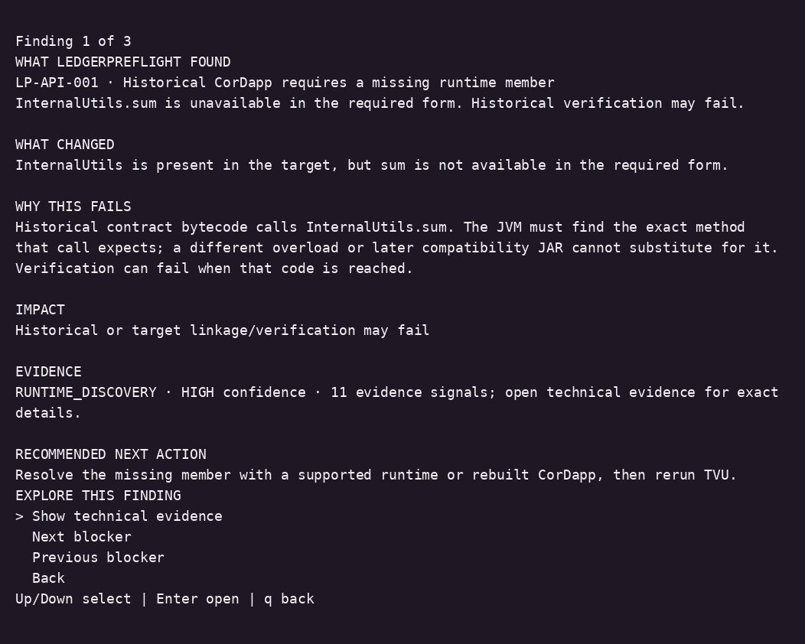
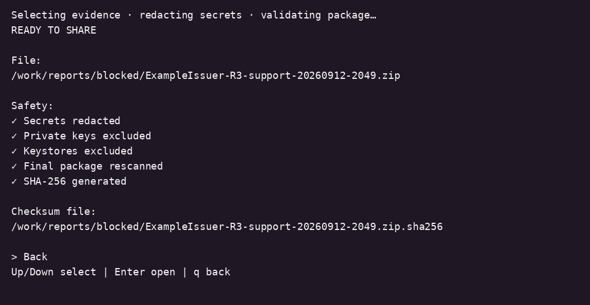

# LedgerPreflight

**Know what will break before you upgrade Corda.**

LedgerPreflight is a standalone Linux CLI for engineers preparing Corda upgrades. A 4.11 → 4.12 failure can take days of TVU runs, schema troubleshooting and JAR/classpath inspection to understand. It compares your current node with prepared target artifacts, explains blockers and packages the evidence for investigation.


## Install

**Pre-release: no GitHub Release is published yet.** Real isolated Corda validation is pending. For now, [build and package from source using Docker](docs/REPRODUCIBILITY.md). The following release installation paths become available after publication.

Recommended quick install (Linux x86_64; requires curl, tar and sha256sum):

```sh
curl --fail --show-error --location --proto '=https' \
  https://raw.githubusercontent.com/InfraGuard-Labs/ledgerpreflight/main/install.sh \
  -o install.sh
# Review the script before running it.
sh install.sh
~/.local/bin/ledger-preflight
```

The installer downloads the latest published Linux package and checks `SHA256SUMS` before installation. Use `--version 0.1.0` to select a release or `--prefix /absolute/path` to choose an installation directory. It leaves existing installations intact and prints the next command. No sudo or system Java change is needed.

For manual or offline installation, obtain the Linux tarball and `SHA256SUMS` from the same GitHub Release (or your Docker build), then:

```sh
awk '$2 == "ledger-preflight-0.1.0-linux-x86_64.tar.gz"' SHA256SUMS > package.sha256
test -s package.sha256 && sha256sum -c package.sha256 || exit 1
tar -xzf ledger-preflight-0.1.0-linux-x86_64.tar.gz
cd ledger-preflight-0.1.0
./ledger-preflight --version
```

From that extracted directory, run:

```sh
./ledger-preflight assess \
  --node /path/to/current-node \
  --upgrade-kit /path/to/upgrade-kit
```

**Manual tarball:** use `./ledger-preflight` in the extracted directory. **Installed with install.sh:** add the printed bin directory to PATH, then use `ledger-preflight` from any directory.

The Linux package includes private Java 17. The JAR-only alternative requires an existing Java 17 runtime: verify its entry in `SHA256SUMS`, then run `java -jar ledger-preflight-0.1.0.jar`. Ubuntu 18.04 is the minimum baseline; 20.04, 22.04 and 24.04 are also validated. [Docker usage](docs/USER-GUIDE.md) is available as an alternative.

## Run

Follow the [official Corda Enterprise upgrade guide](https://docs.r3.com/en/platform/corda/4.12/enterprise/upgrade-guide.html) far enough to prepare a separate target kit: target runtime, matching TVU and target CorDapps, plus `legacy-jars` if required. You need read access to the current node and kit, and a separate writable report directory. TVU logs/error ZIPs and classpath evidence are optional inputs.

```text
upgrade-kit/
├── target Corda runtime JAR
├── target TVU JAR
├── cordapps/
│   ├── rebuilt contract CorDapp
│   └── rebuilt workflow CorDapp
└── legacy-jars/  # only when required
```

Target TVU is needed for TVU readiness, and target CorDapps are needed for application validation. Legacy JARs are optional. Exact filenames are not required: LedgerPreflight identifies supported artifacts from metadata and contents. The current node is analyzed read-only; static assessment needs no database credentials.

After installation with `install.sh` and PATH setup, run `ledger-preflight` for guided path entry, or supply paths directly (manual extraction uses `./ledger-preflight`):

```sh
ledger-preflight assess \
  --node /srv/corda/ExampleIssuer \
  --upgrade-kit /srv/corda-upgrade/4.12.13
```

These paths are examples. No fixed installation layout, filenames or business roles are assumed. [Discovery](docs/UNIVERSAL-DISCOVERY.md) is bounded and reports ambiguous evidence. CI and redirected output stay non-interactive; use `--json` for machine-readable assessment.

## What it checks

- Current/target runtime and exact JVM method/field compatibility
- CorDapp references to unstable internal APIs
- `legacy-jars` duplicates and confirmed classpath shadowing
- Schema conflicts, mixed-case PostgreSQL declarations and TVU readiness
- Supplied TVU results, grouped failures and upgrade readiness gates



## Reports and R3 Support

The CLI writes HTML, JSON and plain-text assessments and shows their paths. Its support action collects relevant evidence, redacts credentials, excludes keys and keystores, rescans the package and creates a SHA-256 checksum. Review it before sharing with R3 Support; this is not an official R3 format.



Static assessment does not connect to the database, require database credentials, modify node.conf or run migrations. Guided TVU is a separate confirmed operation on an isolated copy. **READY TO UPGRADE requires successful required TVU evidence.** Static checks cannot guarantee safety or replace TVU or the official upgrade procedure. See the [security model](docs/SECURITY-MODEL.md).

LedgerPreflight is independent, not affiliated with, endorsed by or supported by R3. Corda/R3 trademarks belong to their owners. Users supply properly licensed Corda artifacts; proprietary binaries are not bundled. [Apache License 2.0](LICENSE).
