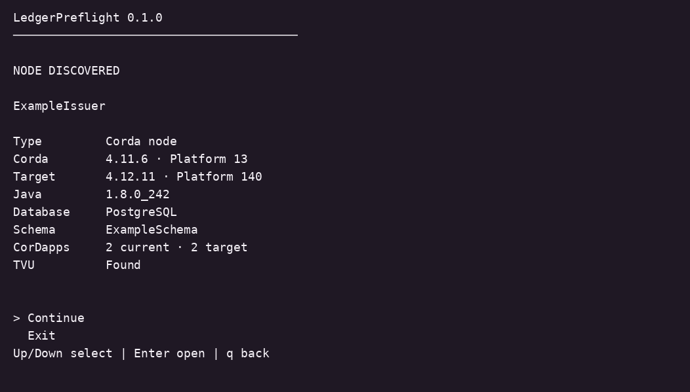
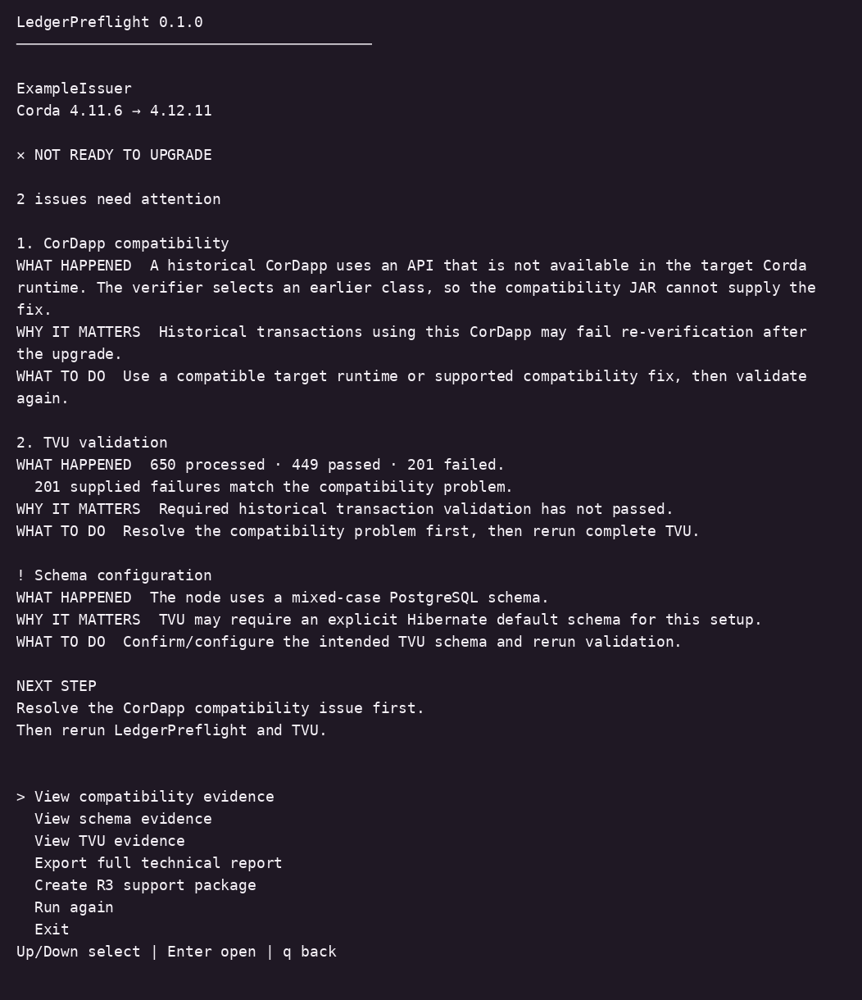
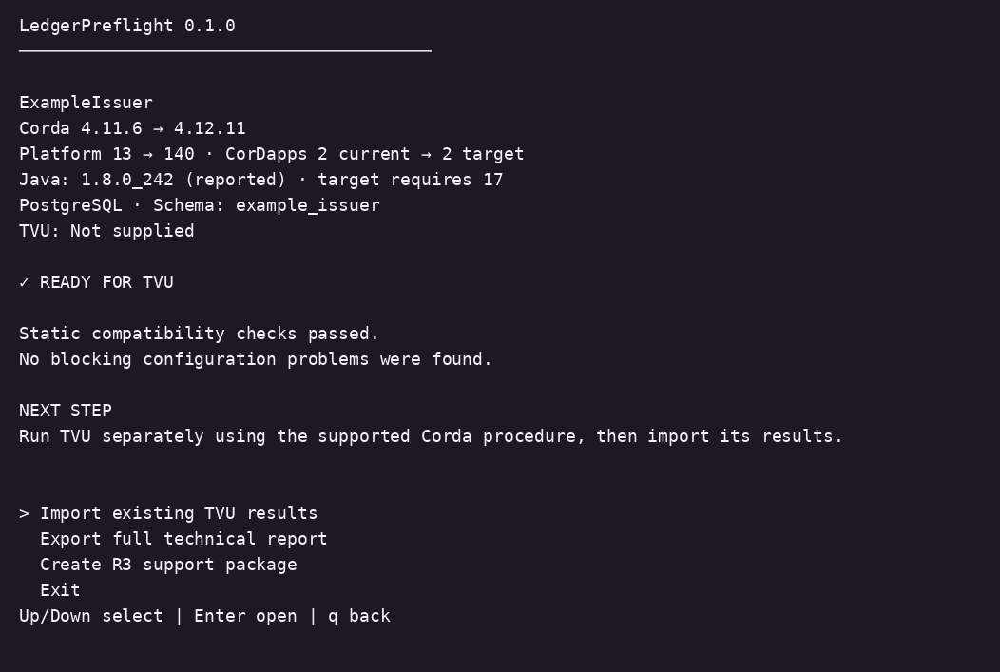
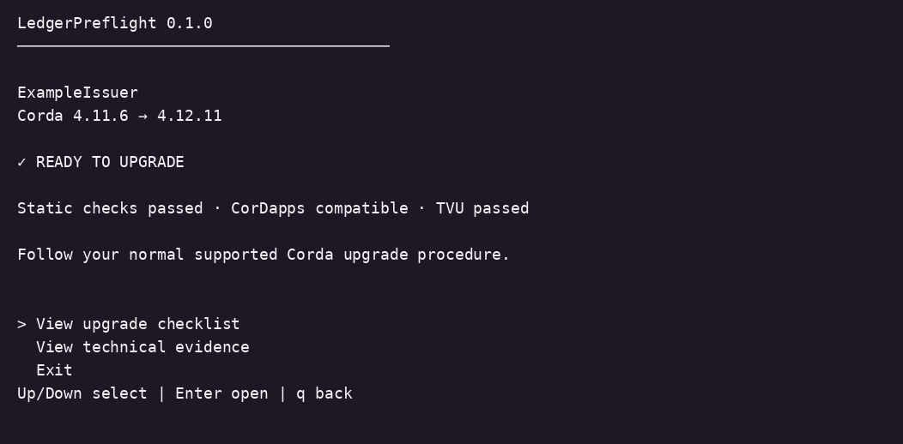

# LedgerPreflight

**Know what may break before you upgrade Corda.**

LedgerPreflight is a standalone Linux CLI. Point it at your current Corda node and prepared target upgrade kit to discover the environment, understand upgrade problems, and see what to do next. Technical reports and sanitized R3 Support packages are generated locally.

**0.1.0 is a pre-release candidate.** No release is published yet. A fresh isolated real-environment Run A, followed by the remaining TVU validation states, is required before publication. [Build with Docker](docs/REPRODUCIBILITY.md).

## Prepare

Keep the current node intact and prepare a separate upgrade kit using the [supported Corda upgrade procedure](https://docs.r3.com/en/platform/corda/4.12/enterprise/upgrade-guide.html):

```text
upgrade-kit/
├── target Corda runtime
├── matching Transaction Validator Utility (TVU)
├── cordapps/
│   ├── rebuilt target contract CorDapp
│   └── rebuilt target workflow CorDapp
└── legacy-jars/   optional, when required
```

Only physical artifacts directly inside node/cordapps and upgrade-kit/cordapps form the default active CorDapp sets. Backup siblings and drivers do not count as CorDapps. Exact filenames are not required: LedgerPreflight inspects manifest and content evidence. Supply a consistent node copy or snapshot, read access to both directories, and a separate writable report directory. Static assessment makes no database connections and changes no node files.

## Run

The Linux x86_64 package bundles private Java 17 and leaves system Java unchanged. The default heap is 256 MiB; allow 512 MiB of process memory and up to 128 MiB of private temporary storage for sequential nested-archive inspection. Inputs remain read-only. It can assess a Java 8 node before the target Java upgrade. The validation matrix covers Ubuntu 18.04, 20.04, 22.04 and 24.04.

Verify the package against its accompanying `SHA256SUMS`, then:

```sh
tar -xzf ledger-preflight-0.1.0-linux-x86_64.tar.gz
cd ledger-preflight-0.1.0
./ledger-preflight --version
./ledger-preflight assess \
  --node /path/to/current-node \
  --upgrade-kit /path/to/upgrade-kit
```

Manual extraction uses `./ledger-preflight`. Once a release is published, `sh install.sh` installs the verified package; add its printed bin directory to PATH and use `ledger-preflight`.

## Understand the result

The interactive flow is **Environment → Result → Technical evidence**. Arrow keys select an action; `q` returns or exits. A numbered fallback works in plain terminals. CI and redirected output never prompt.

- **NOT READY TO UPGRADE:** grouped issues explain what happened, why it matters, and what to do.
- **READY FOR TVU:** static checks passed; complete successful TVU evidence is still required.
- **READY TO UPGRADE:** required static checks and supplied TVU evidence passed. Follow the supported upgrade procedure and your change controls.






Import one complete TVU run with `--tvu-results /path/to/evidence`. Use `--json` for automation, `--verbose` for full findings, or `View technical evidence` for interactive detail. The JSON status distinguishes blockers, warnings, and unknown evidence; [exit codes and guidance](docs/USER-GUIDE.md) explain automation behavior.

[Security](SECURITY.md) · [License](LICENSE) · [Technical boundaries](docs/UNIVERSAL-DISCOVERY.md)

Independent software; not affiliated with, endorsed by, or supported by R3. Corda and R3 trademarks belong to their respective owners.
